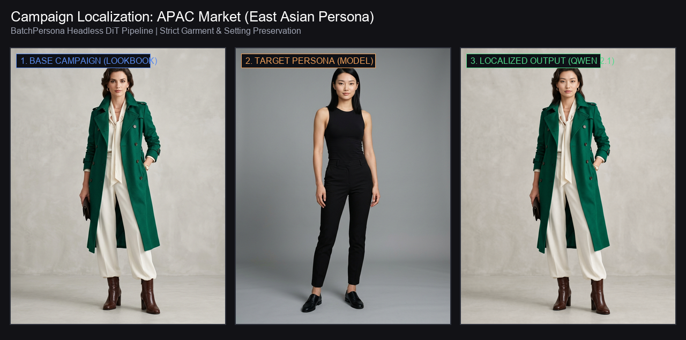
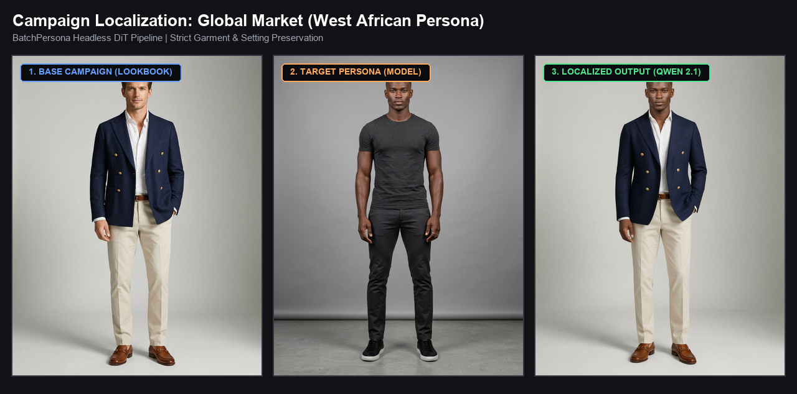
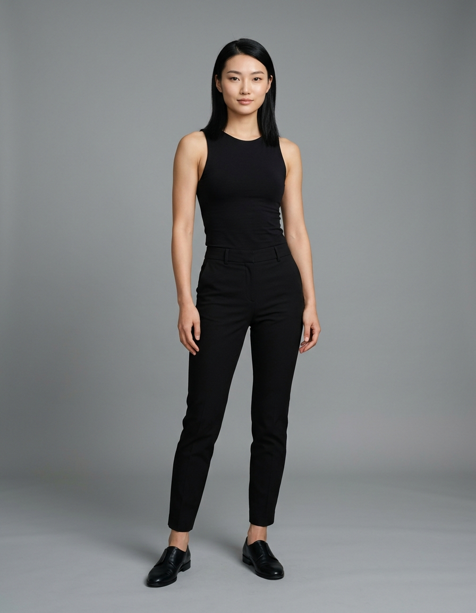
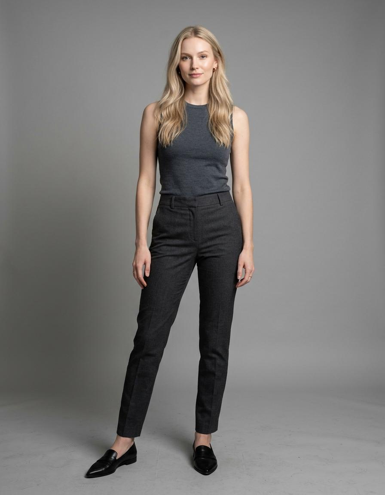
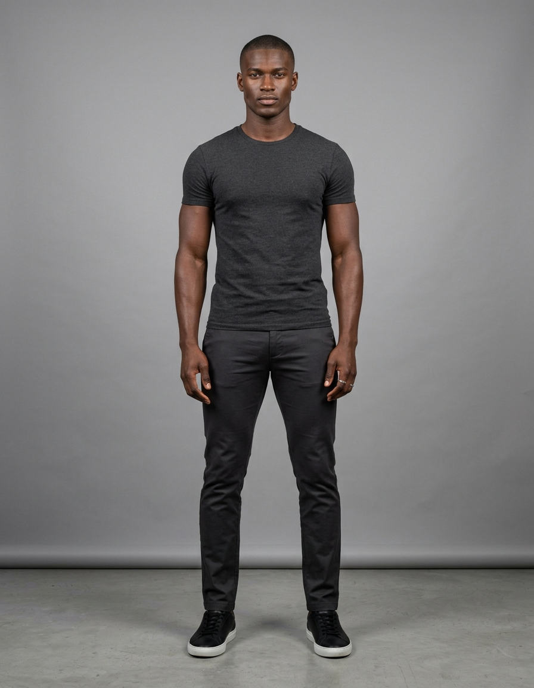
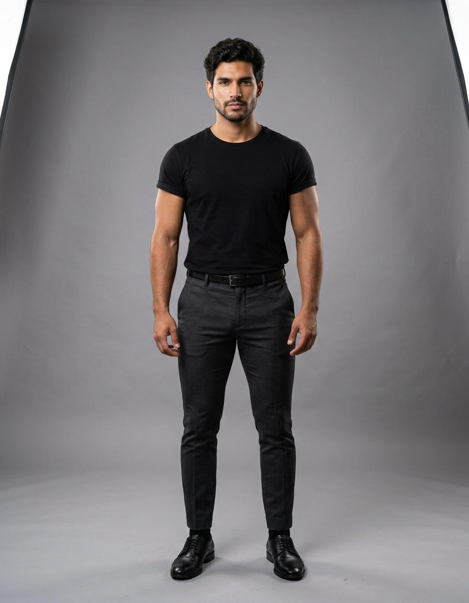
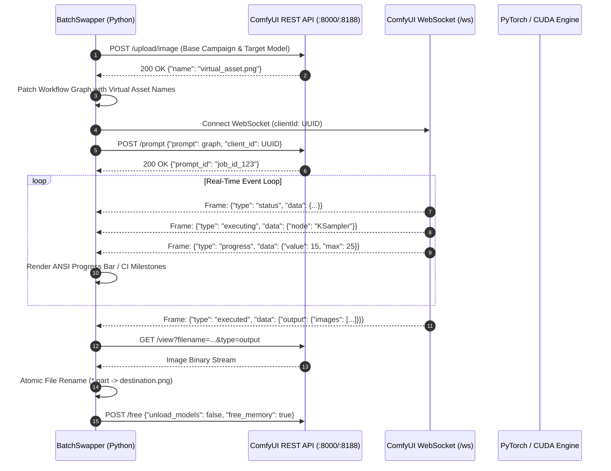

# BatchPersona 🎭

**Production-grade, headless batch-processing pipeline for automated model and persona replacement in commercial advertising campaigns using ComfyUI's REST & WebSocket API and Qwen Image 2.1 DiT multimodal inpainting.**

[](https://www.python.org/)
[](https://github.com/DanAzanza/BatchPersona/actions/workflows/ci.yml)
[](https://github.com/comfyanonymous/ComfyUI)
[](https://huggingface.co/Qwen)
[](tests/)
[](https://github.com/astral-sh/ruff)
[](LICENSE)

---

## 🌟 Executive Overview

In multi-market advertising and e-commerce lookbook production, localizing campaigns for distinct demographics (APAC, LATAM, EMEA, North America) traditionally requires either costly reshoots or manual compositing by digital artists.

**BatchPersona** automates this end-to-end through a headless, resilient CLI pipeline. Given a single base campaign lookbook (photographed in studio with styling, tailoring, and lighting) and a directory of target reference model portraits, the pipeline sequentially swaps the subject's identity, face, skin tone, and hair while **strictly preserving 100% of the apparel, tailoring, accessories, and studio background**.

```
Base Campaign Asset (Full-Body Lookbook)
          +
Target Model Portraits (Diverse Identities)
          │
          ▼
   [BatchPersona Engine] ── Headless ComfyUI REST + WebSocket
          │
          ├── Dynamic Prompt Graph Injection
          ├── VRAM-Guarded Sequential Execution (OOM Prevention)
          ├── Asynchronous WebSocket Event Tracking
          └── Atomic Asset Export & Validation
          │
          ▼
Localized Commercial Assets (data/output/)
```

---

## 📸 Visual Showcase & Results

The pipeline generates authentic, photorealistic model replacements while maintaining pixel-level consistency on apparel tailoring, folds, textures, and studio lighting:

### Example 1: Female Fashion Lookbook Localization (APAC Market)



### Example 2: Male Fashion Lookbook Localization (Global / West African Persona)



---

### Side-by-Side Model Replacement Matrix

| 1. Base Campaign (`<image1>`) | 2. Target Persona (`<image2>`) | 3. BatchPersona Output (Qwen 2.1 DiT) | Market Focus |
| :---: | :---: | :---: | :---: |
|  |  |  | **APAC** (East Asian Model, 100% Lookbook Kept) |
|  |  |  | **EMEA** (Nordic Model, 100% Lookbook Kept) |
|  |  |  | **GLOBAL** (West African Model, 100% Lookbook Kept) |
|  |  |  | **LATAM** (South American Model, 100% Lookbook Kept) |

---

## 🏗️ Architecture & Core Innovations

### 1. Maskless DiT Multimodal Conditioning vs. Traditional Inpainting

Traditional inpainting pipelines rely on binary segmentation masks and IP-Adapter / ControlNet stacks. While functional, binary masks frequently produce **seam artifacts, fringe halos, and color bleed** along garment edges, particularly with complex textures, hair strands, and delicate collars.

**BatchPersona leverages Qwen Image 2.1**, a native multimodal Diffusion Transformer (DiT):

| Parameter / Metric | Traditional SDXL + Inpaint Mask | Qwen 2.1 Maskless DiT (Flagship) | Autonomous Alpha Composite |
| :--- | :--- | :--- | :--- |
| **Workflow Template** | `model_swap_api.json` | `model_swap_qwen21_maskless_api.json` | `model_swap_auto_mask_api.json` |
| **Mask Requirement** | Mandatory 1-bit or 8-bit alpha mask | **None (Zero Mask Seams)** | None (BiRefNet / RemBg auto) |
| **Conditioning Method** | VAEEncodeForInpaint + Cross-Attn | Multimodal Cross-Attention (`<image1>`, `<image2>`) | Hard pixel compositing |
| **Garment Preservation** | Bound to mask boundary accuracy | Photorealistic semantic understanding | 100% (Alpha cutout over base) |
| **Identity Transfer** | Facial crop projection | Holistic identity (hair, skin tone, skull anatomy) | Head/Torso cutout only |
| **Hardware Overhead** | Moderate (~8 GB VRAM) | Higher compute, INT8-optimized (~12 GB VRAM) | Ultra-light (~3 GB VRAM) |

### 2. ComfyUI Headless Execution Protocol

When interfacing with ComfyUI headlessly, passing the interactive UI canvas JSON (`workflow.json`) causes execution failures because the server's execution graph engine requires the **Prompt API Schema** (node IDs mapping strictly to `class_type` and resolved input edges):



---

## 💻 Software Engineering Highlights

* **Layered Architecture & Strict Typing**: Fully typed using `typing.Self`, `Path`, `collections.abc`, and dataclasses. Adheres strictly to Command-Query Separation (CQS) and clean abstraction levels.
* **Fail-Fast Configuration**: `SwapperConfig` validates file existence, directory access, and timeout bounds immediately at initialization, avoiding runtime failures halfway through a batch.
* **Deadlock-Free WebSockets**: `track_execution` enforces non-blocking socket timeouts (`ws.settimeout(min(2.0, remaining))`) with overall wall-clock deadlines to prevent infinite hangs if the ComfyUI backend stalls.
* **OOM & Memory Management**: Between batch iterations, the client invokes `/free` with PyTorch CUDA cache clearing. In the event of CUDA Out-Of-Memory errors, it triggers full model eviction (`unload_models=True`) before continuing.
* **Atomic File Writes**: Image assets are streamed to unique temporary staging files (`.part`) and atomically replaced into the target directory to prevent truncated assets during crashes or network interruptions.
* **CI-Aware Progress Logging**: Automatically senses interactive TTY vs. headless CI environments, toggling between an in-place ANSI progress bar and clean 25% milestone logging to eliminate log pollution.

---

## 📂 Repository Structure

```text
BatchPersona/
├── data/
│   ├── input_campaign/          # Standardized 896x1152 fashion lookbooks
│   │   ├── campaign_fashion_female.png
│   │   └── campaign_fashion_male.png
│   ├── input_models/            # Diverse multi-ethnic full-body portraits
│   │   ├── model_east_asia_f01.png
│   │   ├── model_west_africa_m01.png
│   │   ├── model_nordic_f01.png
│   │   └── model_south_america_m01.png
│   └── output/                  # Localized campaign deliverables
├── docs/
│   └── images/                  # Showcase banners and comparison matrix assets
├── workflows/
│   ├── model_swap_qwen21_maskless_api.json  # 🌟 Flagship Qwen 2.1 DiT API graph
│   ├── model_swap_api.json                  # SDXL Inpainting fallback graph
│   ├── model_swap_auto_mask_api.json        # RemBg/BiRefNet autonomous masking
│   └── model_swap_composite_api.json        # Lightweight compositor fallback
├── scripts/
│   ├── batch_swapper.py         # Headless REST/WebSocket orchestrator
│   ├── generate_testdata.py     # Pure Python synthetic lookbook/portrait generator
│   └── prepare_fullbody_dataset.py # Centering-aware dataset preprocessor (ImageOps.fit)
├── tests/
│   └── test_batch_swapper.py    # Comprehensive test suite (47 tests, 92% branch cov)
├── install.bat                  # ⚡ Windows 1-Click Environment Setup & Self-Test
├── install.sh                   # ⚡ Linux/macOS 1-Click Environment Setup & Self-Test
├── run_pipeline.bat             # 🚀 Windows Interactive Management & Batch Runner
├── run_pipeline.sh              # 🚀 Linux/macOS Interactive Management & Batch Runner
├── .env.example                 # Configuration template (COMFYUI_SERVER, timeout)
├── pyproject.toml               # Modern packaging, pytest, and ruff configuration
├── requirements.txt             # Minimal, locked production dependencies
├── .gitignore                   # Caches, virtual environments, and temporary artifacts
├── LICENSE                      # MIT License
└── README.md
```

---

## 🚀 Quickstart Guide

### 1. One-Click Automated Setup (Zero Friction)

BatchPersona provides automated installers that configure a dedicated virtual environment, install dependencies, synthesize initial lookbooks, and run a self-test suite:

* **Windows**: Double-click **`install.bat`** (or execute `cmd /c install.bat`).
* **Linux / macOS**:
  ```bash
  chmod +x install.sh run_pipeline.sh
  ./install.sh
  ```

*Manual Setup Fallback:*
```bash
git clone https://github.com/DanAzanza/BatchPersona.git
cd BatchPersona
python -m venv .venv
source .venv/bin/activate  # On Windows: .venv\Scripts\activate
pip install -r requirements.txt
```

### 2. Interactive Pipeline Runner

Launch the interactive management console to execute campaigns, run zero-GPU dry runs, or inspect tests:

* **Windows**: Double-click **`run_pipeline.bat`**
* **Linux / macOS**: Execute **`./run_pipeline.sh`**

```text
===========================================================================
      BatchPersona - Headless ComfyUI Model Replacement Pipeline
===========================================================================
  Python runtime: .venv\Scripts\python.exe
  Default server: 127.0.0.1:8000
===========================================================================

  [1] Run Commercial Model Swap  (Campaign Lookbooks - Diverse Personas)
  [2] Run Quick Dry-Run          (Instant Zero-GPU Verification, < 1s)
  [3] Run Quality Gate and Tests (Pytest 55/55 + Coverage + Ruff)
  [0] Exit
```

Or pass arguments directly through the runner from your terminal:

```cmd
run_pipeline.bat --campaign data\input_campaign\campaign_fashion_female.png --models-dir data\input_models
```

### 3. Generating Synthetic Datasets (Zero Downloads)

For automated CI environments or local testing without external image downloads, generate procedural synthetic lookbooks and multi-ethnic portraits:

```bash
python scripts/generate_testdata.py --output-dir data --size 1024
```

### 4. Preprocessing Full-Body High-Fidelity Lookbooks

To standardize high-resolution campaign assets to the canonical 3:4 diffusion aspect ratio (`896x1152`) without squashing or cutting off heads:

```bash
python scripts/prepare_fullbody_dataset.py --source-dir path/to/raw_photos --output-dir data
```

---

## 🕹️ CLI Runner & Orchestration

### Headless Batch Execution

Run the model replacement pipeline against an active ComfyUI instance:

```bash
python scripts/batch_swapper.py \
  --server 127.0.0.1:8000 \
  --campaign data/input_campaign/campaign_fashion_female.png \
  --models-dir data/input_models \
  --output-dir data/output \
  --workflow workflows/model_swap_qwen21_maskless_api.json \
  --market-tag apac \
  --timeout 300.0
```

### CLI Arguments Reference

| Argument | Type | Default | Description |
| :--- | :--- | :--- | :--- |
| `--server` | `str` | `127.0.0.1:8188` | ComfyUI host address and port (`host:port`). |
| `--campaign` | `Path` | *Required* | Path to base campaign lookbook advertisement. |
| `--models-dir` | `Path` | *Required* | Directory containing target model reference portraits. |
| `--output-dir` | `Path` | `data/output` | Destination directory for localized campaign assets. |
| `--workflow` | `Path` | `workflows/model_swap_qwen21_maskless_api.json` | ComfyUI API prompt JSON template. |
| `--market-tag` | `str` | `global` | Campaign market identifier for output naming (`apac`, `latam`, `emea`). |
| `--mask` | `Path` | `None` | Path to optional manual segmentation mask. |
| `--filter` | `str` | `*` | Glob pattern to filter models inside `--models-dir` (e.g. `*east_asia*`). |
| `--timeout` | `float` | `300.0` | Execution timeout in seconds per individual asset. |

---

## 🧪 Verification & Test Suite

The test suite provides **92% branch coverage** without requiring an active GPU or live ComfyUI instance by leveraging mocked WebSocket frame streams, mock REST sessions, and procedural image fixtures.

Run the complete test suite with coverage report:

```bash
python -m pytest tests --cov=scripts --cov-report=term-missing -v
```

### GitHub Actions CI Parity (Run CI Locally)

Mirror the exact GitHub Actions multi-stage CI pipeline deterministically on your local machine with a single command:

```bash
python scripts/run_ci_locally.py
```

This sequentially runs:
1. `ruff check .` (PEP compliance static linting)
2. `ruff format --check .` (Code style formatting verification)
3. `python scripts/generate_testdata.py --output-dir .ci_local_staging --size 256` (Synthetic data CI smoke test)
4. `pytest tests --cov=scripts --cov-report=term-missing -v` (Full unit & integration regression suite)
5. Automatic cleanup of all staging artifacts

### Coverage Breakdown

```text
Name                                  Stmts   Miss Branch BrPart  Cover   Missing
---------------------------------------------------------------------------------
scripts\batch_swapper.py                389     32    128     22    89%   ...
scripts\generate_testdata.py            166      2      6      1    98%   ...
scripts\prepare_fullbody_dataset.py      73      2     28      3    95%   ...
---------------------------------------------------------------------------------
TOTAL                                   628     36    162     26    92%
```

### Linting & Formatting Quality Gate

Verify compliance with strict PEP standards:

```bash
python -m ruff check .
python -m ruff format --check .
```

---

## ⚖️ License

Distributed under the **MIT License**. See `LICENSE` for details.
