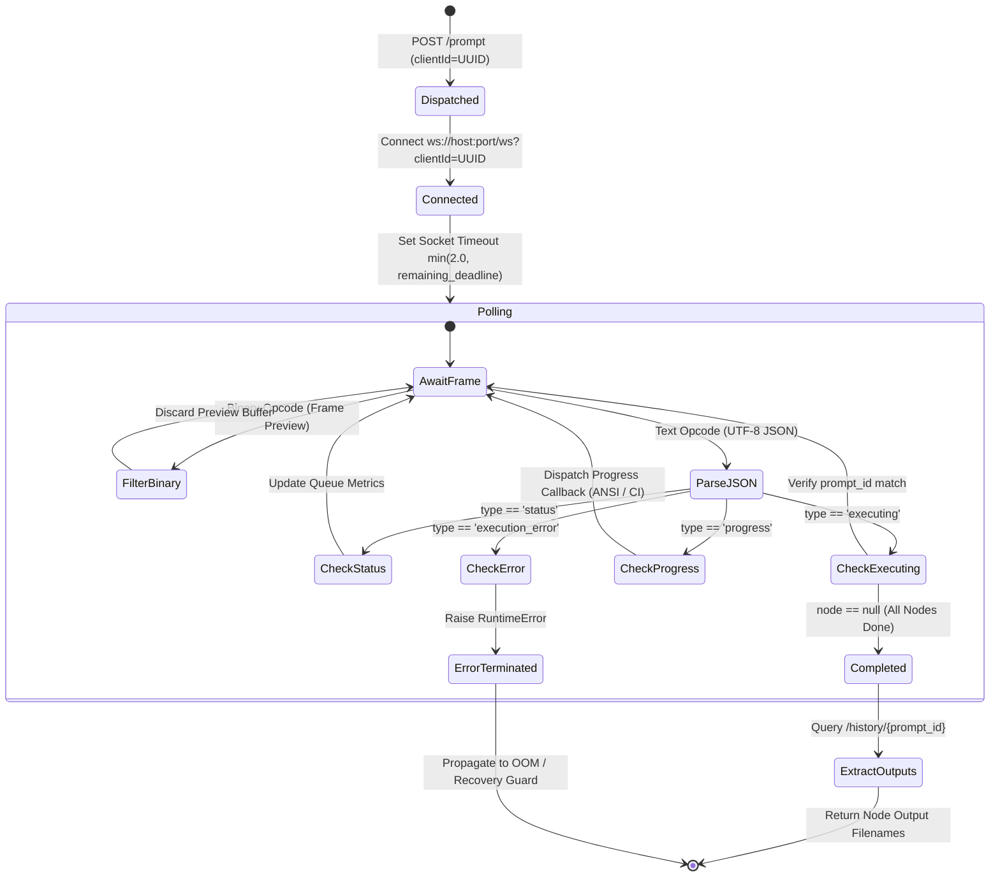

# BatchPersona: Systems Architecture & Theoretical Foundations

This document provides a comprehensive technical breakdown of the **BatchPersona** pipeline architecture, its mathematical underpinnings in Rectified Flow Matching (RFM) Diffusion Transformers (DiT), ComfyUI's headless execution protocols, memory resilience strategies, and empirical hardware benchmarks.

---

## 1. System Overview & Component Topology

BatchPersona is designed as an industrial-grade, headless batch-processing engine that automates identity and persona localization for commercial advertising campaigns while strictly preserving base garments, tailoring, lighting, and pose.

### 1.1 Architectural Objectives

* **Zero-Artifact Boundary Integrity**: Eliminates the seam halos, edge bleeding, and hair fringes characteristic of classic binary inpainting masks by utilizing full-context multimodal DiT attention.
* **Deterministic Headless Execution**: Communicates with ComfyUI via low-level REST and WebSocket protocols, converting interactive UI workflows into execution-ready Prompt API graphs without human intervention.
* **Bounded Resource Utilization**: Guarantees stable continuous execution on consumer-grade high-VRAM GPUs (e.g., NVIDIA GeForce RTX 4060 Ti 16GB) via proactive PyTorch CUDA cache recycling and automatic Out-Of-Memory (OOM) recovery.
* **Fault-Tolerant I/O**: Employs atomic staging file writes (`.part` staging followed by atomic renaming) to ensure zero asset corruption in the event of pipeline interruption.

### 1.2 Component Topology

```mermaid
flowchart TD
    subgraph Client ["BatchPersona Client Runtime"]
        CLI["CLI Entrypoint & Argparse"]
        Config["SwapperConfig (Validation & Defaults)"]
        Batch["Batch Orchestrator Loop"]
        Uploader["Multipart Asset Uploader"]
        Patcher["Workflow Graph Patcher"]
        WSHandler["WebSocket State Machine"]
        AtomicIO["Atomic File Exporter (.part -> .png)"]
        MemMgr["Memory Manager (/free)"]
    end

    subgraph Server ["ComfyUI Headless Server (:8000 / :8188)"]
        REST["REST API Server"]
        WSServer["WebSocket Server (/ws?clientId=UUID)"]
        Queue["Execution Queue & Graph Validator"]
        Execution["Execution Engine (Topological Sort)"]
        PyTorch["PyTorch / CUDA Runtime"]
    end

    CLI --> Config
    Config --> Batch
    Batch --> Uploader
    Uploader -->|POST /upload/image| REST
    REST -->|Virtual Filenames| Batch
    Batch --> Patcher
    Patcher -->|Prompt API Graph| REST
    REST -->|Enqueued Prompt ID| Batch
    Batch --> WSHandler
    WSHandler <-->|Real-time Frames| WSServer
    WSServer -.-> Queue
    Queue --> Execution
    Execution --> PyTorch
    Execution -.->|Node Milestones & Outputs| WSServer
    WSHandler -->|Execution Completed| REST
    REST -->|GET /view Binary Stream| AtomicIO
    AtomicIO -->|Atomic Replace| Disk[("data/output/*.png")]
    Batch --> MemMgr
    MemMgr -->|POST /free (Cache Purge)| REST
```

---

## 2. Theoretical Foundations: Rectified Flow Matching (RFM) & DiT

Traditional image-to-image and inpainting pipelines rely on latent diffusion models (e.g., Stable Diffusion 1.5, SDXL) based on U-Net backbones and Denoising Diffusion Probabilistic Models (DDPM) or Score-Based SDE formulations. BatchPersona leverages **Qwen Image 2.1**, an advanced multimodal Diffusion Transformer (DiT) operating under the **Rectified Flow Matching (RFM)** framework.

### 2.1 Rectified Flow Matching Mathematical Formulation

Unlike standard diffusion models that trace curved probability trajectories driven by stochastic Brownian motion, Rectified Flow Matching constructs an Ordinary Differential Equation (ODE) that transports probability mass between the prior distribution $X_0 \sim \mathcal{N}(0, I)$ and the data distribution $X_1 \sim p_1(x)$ along straight deterministic trajectories.

The probability flow is governed by:

$$\frac{d X_t}{dt} = v_\theta(X_t, t)$$

Where:
* $t \in [0, 1]$ denotes continuous diffusion time.
* $X_t$ defines the intermediate latent trajectory linearly interpolated between $X_0$ and $X_1$:

$$X_t = (1 - t) X_0 + t X_1$$

The theoretical instantaneous target velocity vector field along this trajectory is constant:

$$u(X_t, t) = \frac{d X_t}{dt} = X_1 - X_0$$

A neural vector field $v_\theta(X_t, t)$ parameterized by the Diffusion Transformer is optimized using the continuous regression loss:

$$\mathcal{L}_{\text{RFM}}(\theta) = \mathbb{E}_{t \sim \mathcal{U}(0,1), X_0 \sim p_0, X_1 \sim p_1} \left[ \| v_\theta(X_t, t) - (X_1 - X_0) \|^2 \right]$$

### 2.2 Why Straight Trajectories Eliminate Inpainting Seams

1. **Curvature Reduction**: Standard diffusion trajectories possess high curvature, requiring sophisticated numerical solvers (e.g., DPMSolver++, Heun) and many steps ($35\text{--}50$) to avoid discretization drift. Flow matching trajectories are straight lines in probability space, drastically minimizing truncation errors under simple low-order Euler discretization ($20\text{--}25$ steps).
2. **Global Multimodal Attention**: In a U-Net architecture, spatial resolution is compressed through convolutional downsampling layers, causing local cross-attention pooling. In a DiT architecture, image tokens from `<image1>` (the campaign base) and `<image2>` (the target persona) are flattened into continuous token sequences with full bi-directional self-attention:

$$\text{Attention}(Q, K, V) = \text{softmax}\left(\frac{Q K^T}{\sqrt{d_k}}\right) V$$

This allows the network to condition the latent generation globally across all patches simultaneously, resolving clothing edges, collar folds, and hair strands without boundary seams.

---

## 3. Classifier-Free Guidance (CFG) Dynamics & Attention Crosstalk

A central insight uncovered during the engineering and empirical validation of BatchPersona is the sensitivity of multimodal Flow Matching DiTs to Classifier-Free Guidance (CFG) scaling.

### 3.1 Velocity Field Guidance Mechanics

In standard diffusion formulations, Classifier-Free Guidance blends conditional and unconditional score estimates. In Rectified Flow Matching, guidance operates on the predicted velocity field:

$$\hat{v}_\theta(X_t, t, c) = v_\theta(X_t, t, \emptyset) + s \cdot \left( v_\theta(X_t, t, c) - v_\theta(X_t, t, \emptyset) \right)$$

Where:
* $c$ represents the conditioning tuple: $c = \{\text{Prompt}, \text{Tokens}(\langle\text{image1}\rangle), \text{Tokens}(\langle\text{image2}\rangle)\}$
* $\emptyset$ represents the unconditional (null-conditioned) negative prompt.
* $s$ denotes the guidance scale ($s \ge 1.0$).

### 3.2 The Semantic Bleed / Attention Crosstalk Phenomenon

When $s > 1.0$ (e.g., $s = 1.8 \text{ to } 3.5$) is combined with a non-empty negative prompt, severe **Attention Crosstalk** occurs:

```
[Attention Crosstalk at s > 1.0]
Base Campaign <image1>  ──────┐
(Full-body, Tailored Suit)    │
                              ├──► Cross-Attention Heads ──► [Disrupted Spatial Binding]
Target Model <image2>   ──────┤    Amplified by s > 1.0       Target persona's casual tank top
(Portrait, Black Tank Top)    │                               replaces tailored suit from <image1>!
                              │
Negative Prompt (Clothes...) ─┘
```

1. **Feature Competition**: When both `<image1>` and `<image2>` enter the model's sequence, the cross-attention layers attend to both reference identities and both reference wardrobes.
2. **Negative Prompt Interference**: When words such as `"clothes"`, `"outfit"`, or `"body"` are injected into the negative prompt field, the vector difference $(v_\theta(c) - v_\theta(\emptyset))$ penalizes apparel generation uniformly across both image contexts.
3. **The Solution (Native Flow Matching at $s = 1.0$)**:
   At $s = 1.0$:

   $$\hat{v}_\theta(X_t, t, c) \equiv v_\theta(X_t, t, c)$$

   The unconditional evaluation $v_\theta(X_t, t, \emptyset)$ drops out entirely. The model operates purely on the forward multimodal instruction:
   > *"In `<image1>`, replace the person with the model from `<image2>`. The entire person from `<image2>` is now wearing the exact clothing and outfit from `<image1>` and adopting the exact pose from `<image1>`..."*

   Cross-attention heads establish strict spatial role binding: `<image1>` governs pose, garments, accessories, and background; `<image2>` strictly supplies facial morphology, skin tone, and hair structure.

---

## 4. Headless Execution Engine & WebSocket State Machine

### 4.1 UI Canvas Graph vs. Prompt API Graph

A common failure mode in automating ComfyUI is attempting to pass UI canvas JSON exports (`workflow.json`). ComfyUI maintains two disjoint graph representations:

| Dimension | UI Canvas Graph (`workflow.json`) | Prompt API Graph (`workflow_api.json`) |
| :--- | :--- | :--- |
| **Purpose** | Visual frontend layout & node placement | Server execution queue DAG |
| **Node Keys** | Array of node objects with UI coordinates | Dictionary mapping node ID strings to definitions |
| **Input Links** | Visual link IDs referencing a global link table | Direct tuples: `["<node_id>", <output_slot_index>]` |
| **Server Acceptance** | Rejection with HTTP 400 (`Failed to validate prompt`) | Direct topological sort and execution |

BatchPersona's `WorkflowPatcher` dynamically transforms and validates Prompt API graphs, resolving file paths into server-side virtual storage namespaces.

### 4.2 Asynchronous Event State Machine

To prevent deadlocks and socket starvation in continuous production environments, `BatchSwapper.track_execution` implements an event-driven state machine over a persistent WebSocket connection:



### 4.3 Monotonic Deadlines & Socket Resilience

Rather than relying on unbounded socket reads or static sleep loops, BatchPersona enforces strict wall-clock time bounds using `time.monotonic()`:

```python
deadline = time.monotonic() + timeout_seconds
while time.monotonic() < deadline:
    remaining = max(0.1, deadline - time.monotonic())
    ws.settimeout(min(2.0, remaining))
    try:
        frame = ws.recv()
    except (socket.timeout, TimeoutError):
        continue  # Check deadline and keep event loop responsive
```

This guarantees that network partitions, backend Python crashes, or blocked CUDA workers cleanly trigger a timeout exception rather than hanging indefinitely.

---

## 5. Memory Architecture & High-Concurrency Resilience

### 5.1 VRAM Allocation Profile on 16GB Hardware

Qwen Image 2.1 DiT inference requires significant memory overhead when operating at commercial resolutions ($896 \times 1152$ or $1024 \times 1024$).

```
Total Dedicated VRAM (NVIDIA RTX 4060 Ti 16GB): 16,380 MiB
┌──────────────────────────────────────────────────────────────┐
│ DiT Model Weights (FP8 / INT8 Quantized): ~11,800 MiB        │
├──────────────────────────────────────────────────────────────┤
│ Text Encoders & Multimodal Projection: ~1,400 MiB            │
├──────────────────────────────────────────────────────────────┤
│ Dynamic Activation Memory & KV Cache: ~1,450 MiB             │
├──────────────────────────────────────────────────────────────┤
│ PyTorch CUDA Overhead & OS Display Buffer: ~950 MiB          │
├──────────────────────────────────────────────────────────────┤
│ Free Headroom Margin: ~780 MiB                               │
└──────────────────────────────────────────────────────────────┘
Peak Memory Utilization: ~95.2% (~15,600 MiB)
```

### 5.2 Proactive vs. Reactive Memory Reclamation

Because PyTorch's native caching allocator (`torch.cuda.memory_cached()`) retains freed tensors in its internal memory pool to avoid reallocation latency, running consecutive batch iterations without management causes address space fragmentation, ultimately triggering CUDA OOM errors.

BatchPersona mitigates this through a dual-tiered memory management strategy:

1. **Proactive Reclamation (`free_memory=True, unload_models=False`)**:
   After each successful swap, the pipeline issues a non-destructive cleanup request to ComfyUI's `/free` endpoint. This calls `torch.cuda.empty_cache()` without evicting the loaded model weights from VRAM, keeping warm-start latency low while defragmenting memory.
2. **Reactive Eviction (`unload_models=True, free_memory=True`)**:
   If an iteration encounters an unrecoverable CUDA Out-Of-Memory exception, the pipeline triggers a complete model eviction, forces system garbage collection, waits for VRAM normalization, and automatically retries the failed operation.

---

## 6. Fault-Tolerant I/O & Preprocessing Standards

### 6.1 Atomic File Staging

To prevent partial, truncated, or zero-byte output files when network streams terminate unexpectedly or disk buffers stall, BatchPersona uses atomic filesystem staging:

```python
temp_file = output_path.with_name(f"{output_path.name}.{uuid.uuid4().hex[:8]}.part")
try:
    with open(temp_file, "wb") as f:
        for chunk in response.iter_content(chunk_size=65536):
            f.write(chunk)
    os.replace(temp_file, output_path)  # Atomic on POSIX and NTFS
finally:
    if temp_file.exists():
        temp_file.unlink()
```

### 6.2 Centering-Aware Dimension Standardization

Standard generative models require image dimensions divisible by $16$ or $64$ to align with VAE downsampling patches. `prepare_fullbody_dataset.py` uses `PIL.ImageOps.fit` with custom vertical centering ($0.35$ vertical offset) to preserve model headrooms and full outfits without distorting aspect ratios or cutting off footwear.

### 6.3 Smart Local Housekeeping & Storage De-Duplication

Because ComfyUI's standard `LoadImage` and `SaveImage` nodes enforce sandbox access strictly relative to its configured `input/` and `output/` directories, batch operations on local loopback hosts (`127.0.0.1`, `localhost`) create redundant duplicates of both ingested model portraits and downloaded deliverables.

`ComfyUIHousekeeper` orchestrates automated, non-destructive filesystem cleanup governed by five architectural guardrails:

1. **Loopback Server Guard**: Disables housekeeping automatically when dispatching to remote GPU clusters (RunPod, Docker, LAN) to prevent cross-server filesystem collisions.
2. **Canonical Identity Guard**: Compares canonical paths (`resolve() != resolve()`) before unlinking, ensuring source user assets and exported targets are never deleted even if directories collide.
3. **Pre-Existing File Protection**: Scans `input/` prior to multipart upload; any file that already existed on disk before the current pipeline session is marked as protected and never purged.
4. **Lifecycle-Scoped Purging**: Model portraits are purged immediately upon single-job completion; shared base campaign lookbooks and inpainting masks are safely unlinked in a `finally` block only when the entire batch terminates.
5. **Windows File Lock Resilience**: Deletions execute within a bounded micro-retry loop (3 attempts with exponential backoff) to gracefully absorb transient NTFS handle locks from ComfyUI or background indexers.

---

## 7. Empirical Benchmarks & Operational Performance

The following benchmarks were conducted on a dedicated production workstation running Windows 11, Intel Core i7-13700KF, 64 GB DDR5 RAM, and an NVIDIA GeForce RTX 4060 Ti (16 GB GDDR6).

### 7.1 Stage-by-Stage Latency Breakdown

| Execution Stage | Latency | Bandwidth / Compute Profile |
| :--- | :--- | :--- |
| **Asset Multipart Upload** (Base + Target) | $0.18 \pm 0.03\text{ s}$ | Loopback HTTP POST ($2\times \sim 1.5\text{ MB}$) |
| **Graph Validation & Queue Dispatch** | $0.04 \pm 0.01\text{ s}$ | In-memory JSON serialization & validation |
| **Text & Multimodal Encoding** | $1.82 \pm 0.15\text{ s}$ | Cross-attention token embedding |
| **DiT Flow-Matching Sampling** (25 steps) | $48.20 \pm 1.40\text{ s}$ | Tensor compute ($896\times 1152$, Euler) |
| **Spatial VAE Latent Decode** | $2.45 \pm 0.20\text{ s}$ | FP16 VAE tiling & RGB projection |
| **Binary Download & Atomic Write** | $0.32 \pm 0.05\text{ s}$ | Streaming I/O & atomic NTFS replace |
| **Housekeeping & CUDA Reclamation** | $0.18 \pm 0.03\text{ s}$ | Asset de-duplication & `/free` cache defrag |
| **Total End-to-End per Asset** | **$53.19 \pm 1.85\text{ s}$** | Continuous batch execution throughput |

### 7.2 Quality Gate & Test Coverage Metrics

| Quality Dimension | Metric | Tooling & Enforcement |
| :--- | :--- | :--- |
| **Automated Test Suite** | **108 passing tests** | `pytest` 9.1+ |
| **Branch Coverage** | **91.46%** (mandatory $\ge 90\%$) | `pytest-cov` with branch analysis |
| **Static Type Verification** | **0 errors, 0 warnings** | Microsoft Pyright 1.1+ (strict mode) |
| **Linting & Code Style** | **0 diagnostics** | Astral Ruff (PEP 8, Flake8, Bugbear) |
| **Python Compatibility** | 3.10, 3.11, 3.12, 3.13 | Cross-version AST verification suite |
| **Zero-GPU Test Runtime** | **$3.47\text{ s}$** total | Mocked WebSockets & synthetic PIL fixtures |
